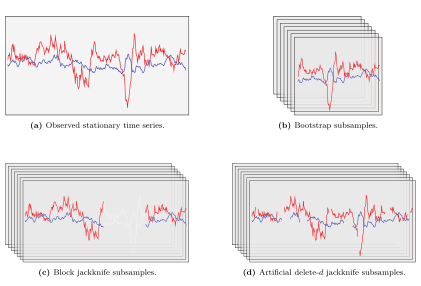

## Description
This repository contains code related to “[Selecting time-series hyperparameters with the artificial jackknife](https://arxiv.org/abs/2002.04697)”.

This article proposes a generalisation of the delete-*d* jackknife to solve hyperparameter selection problems for time series. I call it artificial delete-*d* jackknife to stress that this approach substitutes the classic removal step with a fictitious deletion, wherein observed datapoints are replaced with artificial missing values. This procedure keeps the data order intact and allows plain compatibility with time series. This manuscript shows a simple illustration in which it is applied to regulate high-dimensional elastic-net vector autoregressive moving average (VARMA) models.



## Examples

### Artificial delete-*d* jackknife selection

#### Vector autoregression
```console
> julia ./src/fx_selection.jl true 4 "./VAR_output"
```

#### Vector moving average
```console
> julia ./src/fx_selection.jl false 4 "./VMA_output"
```

### Realised error

#### Vector autoregression
```console
> julia ./src/fx_realised_error.jl true "./VAR_output"
```

#### Vector moving average
```console
> julia ./src/fx_realised_error.jl false "./VMA_output"
```

## Citation
If you use this code or build upon it, please use the following (bibtex) citation:
```bibtex
@misc{pellegrino2022selecting,
      title={Selecting time-series hyperparameters with the artificial jackknife}, 
      author={Filippo Pellegrino},
      year={2022},
      eprint={2002.04697},
      archivePrefix={arXiv},
      primaryClass={stat.ME}
}
```
